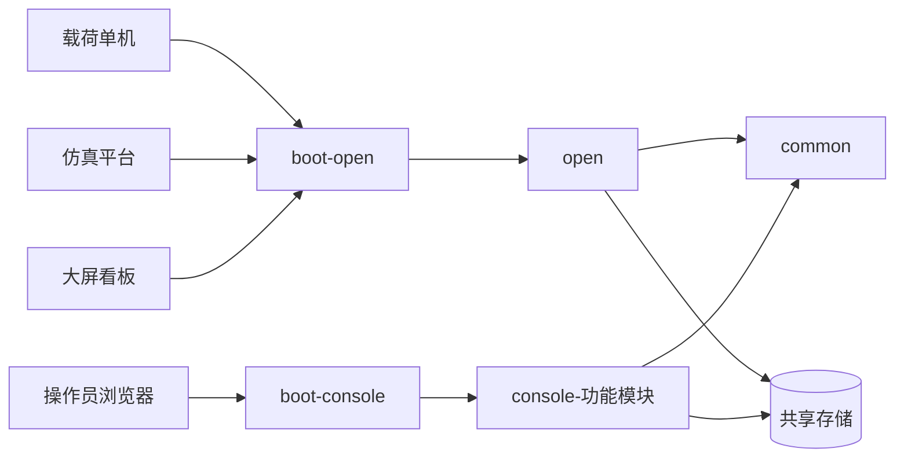

# 仿真数据管理软件 — 分模块需求分析

> 输入：SRS V1.0、`SPO.xlsx`、`docs/original/prototype/`、`接口.docx`、图扑接口模板  
> 业务摘要：[requirements.md](requirements.md)  
> 分期交付（定位/部署/测试）：[phased_delivery.md](phased_delivery.md)  
> 目录约定：[多模块Maven项目目录结构规范.md](多模块Maven项目目录结构规范.md)  
> 包名前缀：`com.skycore.*`  
> 模块目录名不加 `module-` 前缀

## 1. 分析结论（模块边界）

| 模块 | 类型 | 职责一句话 | 开期 |
|------|------|------------|------|
| `common` | jar | SPO/协议模型、公共 DTO、错误码 | 准备 / 贯穿 |
| `open` | jar | 外联：JK-WB、JK-NB-001~004、TCP/指令/入库写 | **第 1 期** |
| `boot-open` | 可执行 | 外联独立部署 | **第 1 期** |
| `console-monitor` | jar | 实时监控 + JK-NB-005 | 第 2 期 |
| `console-task` | jar | 任务管理 | 第 3 期 |
| `console-stats` | jar | 数据统计 | 第 4 期 |
| `console-query` | jar | 数据查询 | 第 5 期 |
| `console-storage` | jar | 本地存储 | 第 6 期 |
| `console-log` | jar | 日志查询 | 第 7 期 |
| `console-admin` | jar | 系统管理 | 第 8 期 |
| `boot-console` | 可执行 | 管控 Web 组装（按需依赖已完成的 `console-*`） | 第 2 期起 |

依赖 DAG：

```text
boot-open    → open            → common
boot-console → console-*（已完成） → common
```

`open` 与任意 `console-*` **互不依赖**；`console-*` 之间互不依赖。

跨进程约定：

- **写入权威**：指令/仿真数据/运行日志由 `open` 写入共享存储  
- **查询与管控**：各 `console-*` 以只读/管控配置为主  
- **实时推送**：管控侧订阅共享库或消息通道，不依赖 `open` jar  



## 2. 部署拓扑

| 部署单元 | 进程 | 典型端口 | 对外暴露 |
|----------|------|----------|----------|
| 外联服务 | `boot-open` | 如 8081 + TCP | WB-001~005、TCP 链路 |
| 管控 Web | `boot-console` | 如 8080 | 操作员 HTTP/WS、静态页 |

两进程可独立启停。详见 [phased_delivery.md](phased_delivery.md)。

## 3. 需求 ID → 模块映射

### 3.1 外部接口 `JK-WB` → `open` / `boot-open`

| 需求标识 | 名称 | 模块 |
|----------|------|------|
| `YXZHJCCSSJGL-JK-WB` | 外部接口需求（章） | open |
| `XZHJCCSSJGL-JK-WB-001` | 载荷单机载荷数据接口 | open |
| `XZHJCCSSJGL-JK-WB-002` | 仿真平台载荷数据接口 | open |
| `XZHJCCSSJGL-JK-WB-003` | 仿真平台仿真指令接口 | open |
| `XZHJCCSSJGL-JK-WB-004` | 载荷单机仿真指令接口 | open |
| `XZHJCCSSJGL-JK-WB-005` | 视图展示接口（大屏） | open |

### 3.2 内部接口 `JK-NB`

| 需求标识 | 名称 | 模块落点 | 说明 |
|----------|------|----------|------|
| `JK-NB-001` | 指令信息处理接口 | open 进程内 | 第 1 期 |
| `JK-NB-002` | TCP 通信接口 | open 进程内 | 第 1 期 |
| `JK-NB-003` | 日志接口 | open 写；console-log 读 | 写第 1 期；读第 7 期 |
| `JK-NB-004` | 存储接口 | open 写；console 读/管控 | 写第 1 期 |
| `JK-NB-005` | 数据实时监控接口 | console-monitor | **第 2 期** |

### 3.3 功能 `GN-HT`（后台）→ open（第 1 期）

| 需求标识 | 名称 | 模块 |
|----------|------|------|
| `GN-HT` / `GN-HT-ZL` / `GN-HT-JK` / `GN-HT-ZMKCL` | 后台处理 / 指令 / TCP / 主模块 | open |

### 3.4 功能 `GN-SJJK` / `GN-XTGL` → 各 console-*（第 2～8 期）

| 功能域 | 模块 | 原型 |
|--------|------|------|
| 实时监控 | console-monitor | `首页-浅色版.html` |
| 任务管理 | console-task | `1-2.1.任务管理.html` |
| 数据统计 | console-stats | `1-2.2.数据统计.html` |
| 数据查询 | console-query | `1-2.3 数据查询.html` |
| 本地存储 | console-storage | `1-2.4.本地存储.html` |
| 日志查询 | console-log | `1-3.日志查询.html` |
| 系统管理 | console-admin | `1-4.系统管理.html` |

细项需求 ID 见 SRS；分期事项见 [phased_delivery.md](phased_delivery.md)。

### 3.5 性能 / 非功能

| 需求标识 | 主责 |
|----------|------|
| `XN-ZHSJ-JKTX` / `XN-ZHSJ-ZLCL` | open |
| `XN-ZHSJ-SJCC`（检索 ≤100ms） | open 写路径；console-query 等读路径 |
| `XN-YW-RZ` | open 写；console-log 读 |
| `FGN-*` / 环境 / 交付 | 全局；鉴权收口在 console-admin |

## 4. SPO.xlsx 落点

| 内容 | common | open | console-* |
|------|--------|------|-----------|
| 指令/遥测/科学帧模型 | 模型与枚举 | 解析打包 | 展示列定义 |
| 判读规则 | 规则 ID | 运行时引擎 | 可选说明 |

权威字典：`docs/original/SPO.xlsx`；SRS 示例字段不硬编码为最终协议。

## 5. 跨模块数据所有权

| 数据域 | 写所有者 | 读消费者 |
|--------|----------|----------|
| 载荷/仿真数据 | open | console-* |
| 运行日志 | open | console-log / monitor |
| 任务元数据 | console-task | open（可选关联） |
| 用户/角色 | console-admin | boot-console |
| 大屏视图 | open（WB-005） | 大屏客户端 |

## 6. 缺口与待澄清项

| # | 问题 | 建议 |
|---|------|------|
| 1 | 数据流图 TCP vs 接口表 HTTP | 外联双栈；联调确认主路径 |
| 2 | SRS 示例字段 vs SPO | **以 SPO 为准**；接口↔sheet 映射见 [api_design.md](api_design.md) 第 3 节 |
| 3 | 接口.docx RS422 与 HTTP/TCP 并存 | 帧格式归 WB-004/NB-001；字典字段归 SPO |
| 4 | 任务与流水线绑定 | 设计阶段定策略 |
| 5 | 库配置生效范围 | 明确 open/console 是否同库 |
| 6 | 大屏鉴权 | WB-005 归 open |
| 7 | Windows 交付约束 | 验收以 Windows 为准 |
| 8 | 第 1 期代码尚未按 SPO sheet 解帧 | 流水线已通；字典装载与按 sheet 解析列入 open 后续 |

## 7. 文档索引

| 文档 | 说明 |
|------|------|
| [phased_delivery.md](phased_delivery.md) | 每期定位、事项、部署与测试 |
| [todo.md](todo.md) | 全局任务与分期勾选 |
| [requirements.md](requirements.md) | 业务摘要 |
| 各模块 `README.md` / `docs/` | 模块边界 |

## 8. 自检

- [x] 外联与管控分属 `open`/`boot-open` 与 `console-*`/`boot-console`
- [x] 命名无 `module-` 前缀；一期一个功能模块可独立开发
- [x] JK-NB-005 归属第 2 期 `console-monitor`
- [x] 依赖仍为 DAG
